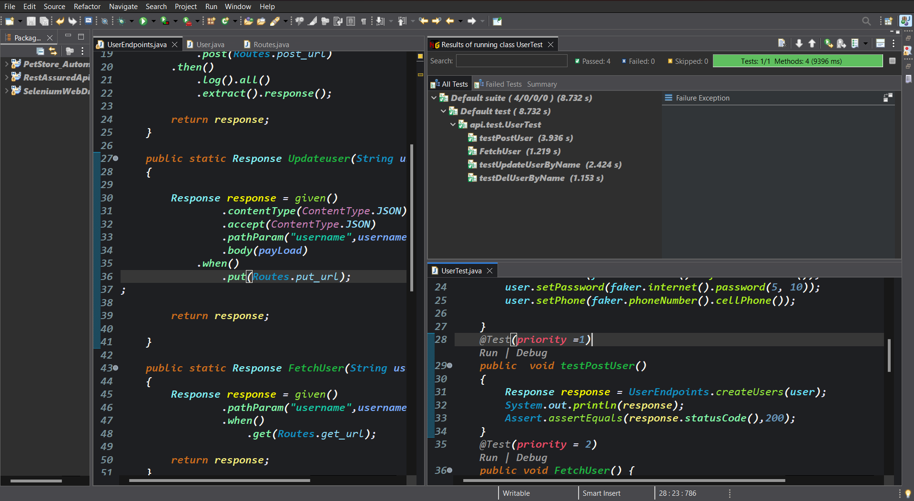

# PetStore Automation Suite

**Overview**  
A robust Selenium + RestAssured-based automation framework for interacting with the PetStore API, designed for seamless CI/CD integration via Jenkins.

##  Features
- End-to-end API and UI test automation for PetStore services using RestAssured.
- Test suite organized with Maven structure & dependency management.
- Integrated with **Jenkins** for continuous integration — auto-triggered builds on GitHub commits and smooth deployment workflows.

##  Tech Stack
- **Java** | **Maven**
- **Selenium WebDriver** (UI automation)
- **RestAssured** (API testing)
- **TestNG / JUnit** (test framework)
- **Jenkins** (CI/CD orchestration)
- ##  Getting Started



### Prerequisites
- Java 8 or above
- Maven
- Selenium WebDriver binaries
- REST-assured dependencies
- Jenkins setup with GitHub integration

### Clone & Build
```bash
git clone https://github.com/Praveen-DevKnight/PetStore_Automation.git
cd PetStore_Automation
mvn clean test
Setup Jenkins
Install Jenkins plugins: Git, GitHub Integration, Maven, etc.

Create a new Freestyle Project or Pipeline.

Configure SCM to use your GitHub repo.

Enable GitHub hook trigger for GITScm polling to auto-trigger builds on push 
Jenkins Plugins
.

Add build steps to execute mvn clean test, generate reports, and optionally push results back to GitHub.

Usage
Push your changes to GitHub → Jenkins detects the push via webhook → it executes the test suite and reports results.

Contributions
Feel free to fork and submit improvements! Ensure well-formatted PRs and passing builds.

License
Open for personal and organizational use — specify your license here (e.g., MIT, Apache 2.0).
